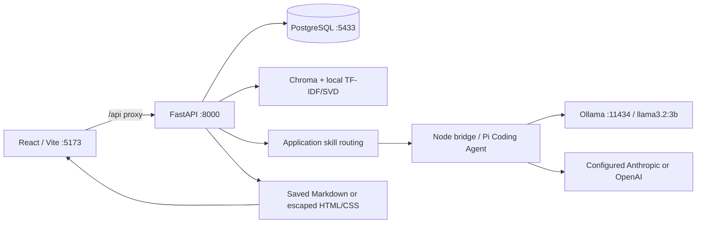

# Architecture

## Components and topology

All demo services listen on loopback. The startup script owns only processes it starts. Vite rewrites `/api` to bare FastAPI routes. PostgreSQL and Ollama binaries/data live under project-local ignored paths. No cloud provider is used by default.

## Database schema

`chat_sessions`: UUID-text primary key, title, JSON user_metadata, llm_provider, llm_model, created_at and updated_at.

`chat_messages`: UUID-text primary key, indexed session_id foreign key, role, text content, JSON citations, JSON artifacts, JSON warnings, skill, grounded, latency_ms and created_at. Session deletion cascades through ORM relationships. Artifact objects contain id, title, type (`markdown`/`html`) and content. References are stable within their saved answer, not global citation IDs.

SQLAlchemy creates initial tables and applies additive JSON-column migrations to older demo tables. For production use versioned Alembic migrations. `backend/migrate_sqlite.py` preserves the original SQLite file while importing legacy rows into PostgreSQL.

## API contracts

| Method/path | Purpose |
|---|---|
| GET `/health` | Database, index count, selected model readiness and ok/degraded status |
| GET `/config` | Provider options, active selection, fallback, normal and content timeouts |
| POST `/config/provider` | Select a known configured provider |
| GET/POST `/sessions` | List or create chats; create accepts title/user_metadata |
| GET/DELETE `/sessions/{id}` | Read or delete a chat |
| GET `/sessions/{id}/messages` | Saved messages with citations/artifacts/warnings |
| POST `/sessions/{id}/messages` | Non-streaming message/result |
| POST `/sessions/{id}/messages/stream` | NDJSON streamed message/result |

Message input: content, optional provider_id and optional skill enum. Schemas are documented at `/docs` and `/openapi.json`. Errors contain `error` and readable `detail`; validation errors include field issues without echoing request bodies. Unknown sessions return 404, unknown provider 400, unavailable provider selection 409, invalid input 422 and database failures 503.

Streaming events are `status`, `sources`, `delta`, optional `artifact`/`warnings`, authoritative `answer`, then `done`; a stream processing failure ends with `error`. The worker owns a separate DB session. The final message is committed before `done`. Disconnect/stop cancels model work; partial output is not saved as a completed answer. The submitted user question can remain saved after a failure.

## Retrieval and ingestion

Source: `https://github.com/ChatPRD/lennys-podcast-transcripts`, default revision `be8ab89a890a833cbba2c892178f823fff178c65`.

`rag/ingest.py` parses YAML source metadata and multiple speaker/timestamp formats, including timestamp-only continuations. It splits long speaker turns into bounded segments and creates chunks capped at 350 estimated text tokens, with two overlapping segments where possible. Chunk IDs include episode identity; metadata preserves source path, guest, title, publication date and timestamp. Split segments inherit the source turn's timestamp; sub-turn timing is not invented. `rag/index.py` fits TF-IDF and 256-dimensional SVD and stores cosine-search vectors in Chroma.

Query retrieval examines up to five times the requested result count, filters same-episode chunks with at least 65% overlap in five-word shingles, prefers distinct episodes before filling remaining slots, and preserves similarity rank. Source payloads include the actual transcript file at the indexed revision and
timestamped YouTube links. Some upstream files contain another episode's title/video metadata. A conservative full guest-name check marks uncertain
metadata and uses the transcript file rather than an untrusted video link. Context is bounded across five selected passages; trailing history is bounded separately. Conversions scan backwards for the latest substantive topic, skipping intermediate document commands; an explicitly requested new topic replaces it. Follow-ups retain that topic. This heuristic is limited for ambiguous changes of subject.

`./scripts/refresh-knowledge.sh` fetches a specified source revision, builds in a separate directory, writes a manifest (revision, hash, episode/chunk counts, timestamp and embedder), and swaps only a completed index. Stop the app before refreshing. Old indexes are retained as ignored backups. Set `TRANSCRIPT_REVISION` intentionally to update source data. Never change the query embedder without rebuilding a compatible index.

`scripts/rebuild-knowledge.py` performs the same complete rebuild directly from
local transcripts. It fails on any unparseable/empty episode, checks that splitting
and chunking preserve dialogue, and verifies actual Chroma counts for every source
episode before activation. The manifest includes each episode's hash, guest and
chunk count. Named-guest searches filter using this entire catalog rather than
depending on the guest appearing in the initial nearest-neighbor results. Restart
the app after replacing the index because retrievers are cached per process.

## Agent and skills

The Python agent retrieves evidence and selects one of `grounded_qa`, `ship_30_for_30`, `markdown_artifact`, `html_artifact`. Explicit validated skill selection overrides keyword routing. Ship rules live in a reusable JSON resource with linked guide provenance. Essays use the content budget; normal answers use smaller limits. The essay writer creates a source-scoped opening, five practical sections and
a takeaway. Each call has a small output budget and an at-most-180-second
timeout; each section is labeled with its actual input source and trimmed at
complete paragraph/sentence boundaries; all sections share the content deadline. Invalid section references
can receive one correction, and at most two short additions address length gaps. A generated document can be requested from the current session.

Pi's `createAgentSession` handles all provider generation. The Node bridge receives JSON through stdin; credentials are not command arguments. In-memory settings/auth/session history avoid project-level instructions and coding tools. Tools, automatic retries and compaction are disabled. Disabling compaction after resource loading avoids an accidental second model call for every local answer.

Local and cloud model names and credentials come from environment settings. Selection is visible in the UI; provider readiness means installed model or configured key. Fallback is disabled by default. If configured, one primary attempt and one different fallback attempt are allowed; fallback resets partial text and actual provider/model metadata is recorded. No hidden cloud fallback.

## Grounding and safety limits

Referential HTML/Markdown conversions use the deterministic conversation-document
tool before retrieval. It selects complete saved evidence paragraphs and practical
bullets across sections, preserves citation identifiers, and renders an extractive
brief up to 450 words. It reuses the original source-backed answer across conversion
chains; it does not call a provider or rewrite facts. Explicit new-topic documents
still retrieve fresh evidence and generate through Pi. Unrelated refusals and
general-knowledge replies stop reuse. Source quality limits of the original answer
remain; formatting is not an independent factual verification. Session provider/model
metadata is preserved on formatting-only requests because no new model answered.

The submitted default `ALLOW_GENERAL_KNOWLEDGE=false` refuses low-similarity/empty retrieval without
a model call for every skill. Optional general-knowledge replies can be enabled explicitly for plain
Q&A only; content-generation skills always require transcript evidence. Optional general replies use
a separate system prompt, carry no citations, are marked `grounded: false`, and display an unsourced
warning. They are not part of the assignment demo configuration. Prompts for grounded answers require excerpt-only facts and valid
citations. Reference validation detects missing/out-of-range source IDs and quotations or
percentages absent from the supplied context. One bounded correction is attempted;
remaining issues flag the draft and prevent artifact creation. A local quantized
[DeBERTa entailment classifier](https://huggingface.co/cross-encoder/nli-deberta-v3-small)
then checks reported prose against the cited passages. Overlapping evidence windows retain the
opening context; only the explicitly cited passages can validate a cited claim. Reader framing and
clearly labeled proposed applications are distinguished from historical claims. Claims below the
configured entailment threshold are removed as whole sentence/bullet units, never rewritten or
edited word by word. Missing verifier weights or failed audits flag drafts and withhold artifacts.
The setup downloads pinned, checksum-verified CPU weights; no additional cloud request is made.
Essays audit each source-scoped section inside their shared deadline; other answers use a bounded
review budget. The classifier can still make mistakes and conservatively remove valid text. Low temperature
(0.2) reduces randomness. It does not validate every claim's meaning. Manual factual evaluation remains essential, particularly for the small local model. Essay length outside 1,100–1,400 words produces a visible warning.

HTML is assembled from escaped generated text, with a small Markdown formatting subset and local inline CSS. In-app previews additionally apply DOMPurify (scripts, event attributes, iframes, forms and embeddings removed), `sandbox=""` (no scripts, same-origin, forms or parent navigation) and CSP `default-src 'none'` (only inline styles and data images/fonts). Markdown raw HTML is not enabled. External loading is blocked in preview. Downloaded/copied source is outside iframe enforcement; server-generated HTML contains escaped text and no generated scripts.

## Operations

JSON logs identify startup, provider/model failures, retrieval/generation timing, fallback, quality warnings and database faults. Prompt bodies and API keys are not intentionally logged. HTML is deterministic and security-tested; preview failures are covered by the UI manual plan rather than remote telemetry. The local demo has no authentication, rate limiting or automated backup service. Operational recovery and extension steps are in README and `docs/manual-test-plan.md`.
